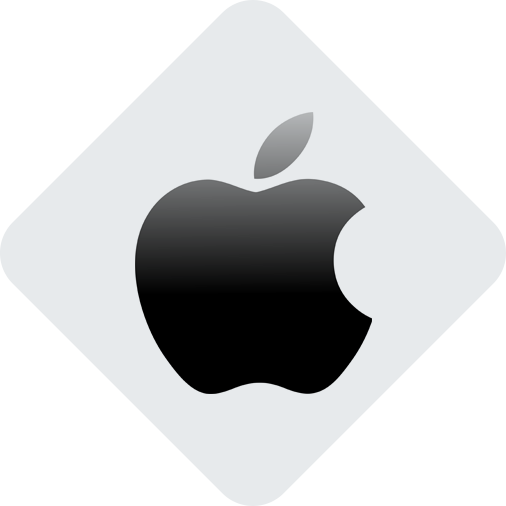

# iPhone banner

> Multilingual banner for iPhone SE, 8+, X, 14.


---

[Description](#description) •
[Project setup](#project-setup) •
[Features](#features) •
[How To Use](#how-to-use) •
[Project Status](#project-status) •
[Room for Improvement](#room-for-improvement) •
[License](#license) •
[Contact](#contact)

![Screenshot][screenshot]

## Description
The application was created on the basis of one of the test tasks.

## Project setup

- Clone this repo to your desktop and run ```yarn``` or ```npm install``` to install all the dependencies.
- Once the dependencies are installed, you can run ```yarn dev``` or ```npm dev``` to start the application.
- After that, you can access it at the address specified in the terminal.
- Before use, assign one of the above screens in the browser's developer tools.

## Features
- Adaptation only for iPhone SE, 8+, X, 14 in portrait orientation (various retinal screens).
- Automatic language selection based on the user's system language.
- 7 languages (en, es, fr, ja, nl, ru, zh) loaded from json (native JavaScript, without i18n); 'en' by default.
- The ability to switch the language by passing the 'lang' parameter in the query string (?lang=en).

## How To Use

Run [Live Demo](https://meek-profiterole-b4721f.netlify.app/)
> !!! before use, assign one of the above screens in the browser's developer tools.

![Tutorial][tutorial]

## Project Status

Project is: *in slow intermittent progress*

## Room for Improvement

To do:

- Paste into window when opened in non-mobile browser

## License

This project is open source and available under the [MIT](../LICENSE).

## Contact
Created by [@RimidalU](https://www.linkedin.com/in/uladzimir-stankevich/) - feel free to contact me!

<p align="right"><a href="#start"></a></p>

<!-- MARKDOWN LINKS & IMAGES -->
[screenshot]: ./readmeassets/Screenshot.png
[tutorial]: ./readmeassets/screencast.webp